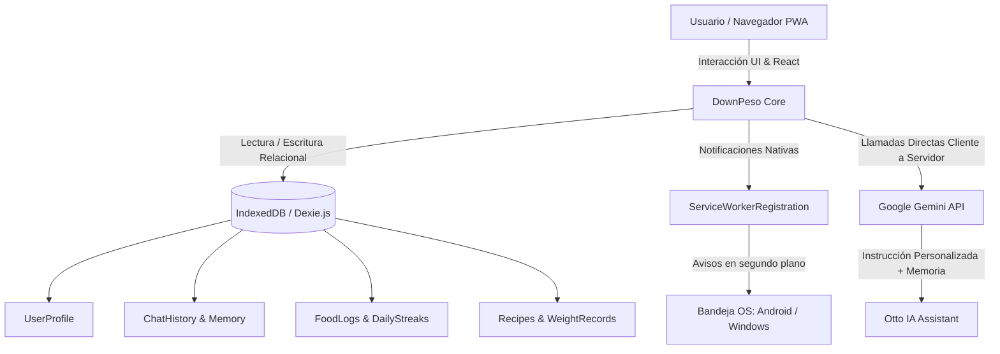

# DownPeso By ChrizDev 🌿⚖️

[](https://vite-pwa-org.netlify.app/)
[](https://react.dev/)
[](https://www.typescriptlang.org/)
[](https://vitejs.dev/)
[](https://tailwindcss.com/)
[](https://dexie.org/)
[](https://ai.google.dev/)
[--Side-success.svg)](#-arquitectura-y-privacidad-100-client-side)

> **DownPeso By ChrizDev** es una Progressive Web App (PWA) de alto rendimiento orientada a la creación de hábitos saludables sostenibles, nutrición casera económica, ejercicio físico progresivo sin equipo y reducción de peso inteligente impulsada por el asistente conversacional **Otto**.

Alojada como un **Frontend Estático (Static Export) en Vercel**, DownPeso opera con **cero costos de infraestructura remota ($0 USD)**. La persistencia relacional, la memoria adaptativa de hábitos y las llamadas a la Inteligencia Artificial se ejecutan íntegramente en el navegador del usuario utilizando **IndexedDB (Dexie.js)** y el SDK oficial de **Google Gemini (`@google/genai`)**.

---

## 🌟 Novedades & Capacidades Destacadas

### 🤖 1. Otto: Coach Personal Proactivo con Control Total de la App
Otto no es un bot pasivo que espera a que le escribas. Es un consejero empático, riguroso y con memoria que te acompaña activamente:
- **Interacción Proactiva**: Te saluda y formula preguntas de seguimiento al inicio y final de cada charla, consultándote por tu nivel de energía, saciedad y agua según el momento del día.
- **Control Total de la Aplicación (Superpoder Autónomo)**:
  Otto interpreta tus mensajes conversacionales y ejecuta directamente cambios y registros técnicos en la base de datos y la interfaz:
  - 💧 *“Otto, tomé 2 vasos de agua”* ➔ Registra el consumo y actualiza la racha.
  - 🍲 *“Otto, comí pechuga con ensalada”* ➔ Guarda la comida con estimación de calorías en el diario de hoy.
  - 🏃 *“Otto, hice 20 min de caminata”* ➔ Marca la actividad física del día.
  - ⚖️ *“Otto, hoy pesé 81.2 kg”* ➔ Actualiza tu peso, recalcula tu IMC y registra el hito.
  - 📝 *“Otto, anota en mi diario que me sentí con mucha energía”* ➔ Guarda una nota en tu diario de hábitos.
  - 🌙 *“Otto, activa el modo oscuro”* ➔ Alterna el tema visual de la aplicación.
  - 🔤 *“Otto, haz la letra más grande”* ➔ Ajusta el tamaño de fuente para accesibilidad.
  - 🌐 *“Otto, cambia el idioma a inglés”* ➔ Modifica el idioma de la app y del prompt.
  - 🧭 *“Otto, llévame a los ejercicios”* ➔ Navega de inmediato a la sección solicitada.
- **Botón Flotante Persistente (FAB)**: Accede a Otto con un solo toque desde cualquier módulo de la app sin perder tu vista actual.

---

### 🍳 2. Recetario Tradicional por Horario & Categorización Inteligente
- **Sugerencia Automática según Horario del Día**:
  - 🌅 **Mañana (05:00 - 12:00)**: Desayunos energéticos y saciantes con avena, huevos, espinacas y fruta para estabilizar la glucosa.
  - 🍲 **Mediodía (12:00 - 18:00)**: Almuerzos saciantes y económicos con legumbres, pechuga, verduras y ensaladas.
  - 🌙 **Tarde / Noche (18:00 - 05:00)**: Cenas ligeras y digestivas bajas en carbohidratos simples para favorecer la quema lipídica nocturna y un descanso reparador.
- **Categorización Contextual al Crear o Generar**:
  - Si estás viendo la pestaña *"Almuerzos"*, cualquier receta creada o generada con el refrigerador se asignará por defecto a *"Almuerzo"*.
  - Selector visual explícito de categoría antes de crear la receta.
  - Modal para **"Añadir Receta Casera Manual"** con nombre, ingredientes, preparación, calorías aproximadas y tiempo.
  - Notificación Toast (`type: 'success'`) confirmando en qué categoría quedó almacenado el platillo.
- **Motor "¿Qué hay en mi refri?"**: Selecciona o escribe los ingredientes disponibles en tu cocina y el Chef IA generará una preparación económica y saciante ajustada a tu categoría deseada.

---

### 📊 3. Dashboard Estadístico & Proyecciones de Reducción de Peso
- **Proyecciones Predictivas Científicas**:
  - **Déficit Calórico Diario**: Cálculo de la brecha entre tu Gasto Total (TDEE) y tu meta calórica recomendada (~400-600 kcal/día).
  - **Ritmo de Descenso Estimado**: Tasa segura de pérdida de grasa corporal de ~0.50 kg a ~0.70 kg por semana sin comprometer masa muscular ni tiroides.
  - **Semanas a la Meta & Fecha Estimada**: Estimación del número de semanas y fecha aproximada de llegada a tu peso objetivo.
  - **Progreso Visual**: Barra interactiva de avance desde tu peso inicial hasta tu meta.
- **Métricas de Consistencia de Hábitos (Últimos 7 Días)**:
  - Porcentaje de días con meta de hidratación cumplida.
  - Consistencia de ejercicio semanal (días activos).
  - Promedio de porciones de vegetales consumidas al día.
  - Contador de días con racha perfecta.

---

### 🔔 4. Notificaciones Push Reales del Sistema Operativo
- **Soporte Nativo con Service Worker**:
  A diferencia de notificaciones simples dentro de la pestaña, DownPeso utiliza `ServiceWorkerRegistration.showNotification()` con patrones de vibración (`[200, 100, 200]`), badge e iconos PWA, garantizando su visualización en la bandeja del sistema en **Android, Windows, macOS y Linux**.
- **Acciones Rápidas**: Posibilidad de registrar *"Ya tomé agua"* (+1 vaso) o *"Recordar en 5 minutos"* directamente desde la notificación.
- **Herramienta de Prueba con Retardo (3 segundos)**: Botón en la configuración para probar una notificación push real, permitiéndote minimizar la app o bloquear la pantalla para comprobar su llegada en el sistema operativo.

---

### ⚙️ 5. Módulo Integral de Configuración & Accesibilidad
- **Tema Visual**: Alterna libremente entre **Modo Oscuro**, **Modo Claro** y **Modo Automático (Sistema)**.
- **Tamaño de Letra**: Opciones **Pequeña (14px)**, **Normal (16px)** y **Grande (18px)** para facilitar la lectura en cualquier pantalla.
- **Internacionalización (i18n)**:
  - 🇪🇸 **Español**
  - 🇺🇸 **English**
  - 🇫🇷 **Français**
  - 🇷🇺 **Русский**
  - Al cambiar de idioma, no solo se traduce la interfaz, sino que **Otto adapta sus respuestas y consejos de nutrición a tu idioma seleccionado**.

---

### 🏃 6. Rutinas Progresivas Sin Equipo & Botiquín Natural
- **Ejercicios Progresivos en Casa**:
  - *Nivel 1: Movilidad Articular* (15 min).
  - *Nivel 2: Cardio Suave Cero Impacto* (18 min).
  - *Nivel 3: Tonificación Funcional* (22 min).
  - *Nivel 4: Quema Grasa por Intervalos* (25 min).
  - Temporizador integrado con intervalos de trabajo y descanso con vibración en móviles.
- **Botiquín Natural Responsable**:
  - Infusiones digestivas, saciantes para frenar la ansiedad dulce y desinflamatorias con ingredientes accesibles (manzanilla, menta, jamaica, canela, jengibre, cúrcuma).
  - Advertencias claras de salud sobre contraindicaciones (hipertensión, gastritis, embarazo).

---

### 💾 7. Respaldos Cifrados Locales (Backup & Restore)
- **Exportación Atómica**: Descarga un archivo JSON con marca de tiempo que incluye tu perfil antropométrico, historial de chat, memoria de Otto, comidas registradas, recetas personalizadas y rachas.
- **Restauración Validada**: Importador con validación estricta mediante **Zod** para transferir tu progreso entre dispositivos sin depender de ninguna nube.

---

## 🏗️ Arquitectura y Privacidad (100% Client-Side)



---

## 💻 Instalación y Desarrollo Local

### Prerrequisitos
- **Node.js**: v18.0 o superior (recomendado v20+ / v22+)
- **npm** o **pnpm**

### Pasos de Instalación
```bash
# 1. Clonar el repositorio
git clone https://github.com/ChrisEna07/DownPeso.git
cd DownPeso

# 2. Instalar dependencias
npm install

# 3. Iniciar servidor de desarrollo con Hot Reload
npm run dev

# 4. Compilar para producción (Static Export)
npm run build

# 5. Previsualizar la compilación de producción localmente
npm run preview
```

---

## 🚀 Despliegue en Vercel (Paso a Paso)

DownPeso está diseñado para ser desplegado como un **Frontend Estático** en Vercel sin servidor de Node.js permanente:

1. Haz un push de tu repositorio a GitHub:
   ```bash
   git push origin master
   ```
2. Inicia sesión en [Vercel](https://vercel.com/) y selecciona **Add New Project**.
3. Importa el repositorio `DownPeso`.
4. En **Build & Output Settings**:
   - **Framework Preset**: `Vite`
   - **Build Command**: `npm run build`
   - **Output Directory**: `dist`
5. Haz clic en **Deploy**. ¡Tu PWA estará disponible en minutos con certificado SSL y CDN global!

---

## 📱 Guía de Instalación como PWA

DownPeso funciona como una aplicación nativa en cualquier sistema operativo:

- **En Android (Chrome / Edge / Samsung Internet)**:
  Aparecerá el banner inferior *"Instalar App"*, o puedes tocar los tres puntos `⋮` y pulsar **"Instalar aplicación"**. Se agregará con su propio icono a tu cajón de aplicaciones.
- **En iOS (iPhone / iPad - Safari)**:
  Toca el botón Compartir (cuadrado con flecha hacia arriba) y selecciona **"Agregar al inicio"** (*Add to Home Screen*).
- **En Windows / macOS (Chrome / Edge)**:
  Haz clic en el icono de instalación en la barra de direcciones del navegador para tener una ventana de escritorio independiente.

---

## 🔒 Privacidad y Clave API de Gemini

- **Tu Clave no sale de tu dispositivo**: La clave de Google Gemini se solicita únicamente para conectar tu navegador directamente con los servidores de Google AI. Se almacena localmente de forma ofuscada y jamás se transmite a ningún servidor de DownPeso.
- **Obtener Clave Gratuita**: Puedes obtener tu clave en cuestión de segundos en [Google AI Studio](https://aistudio.google.com/).

---

## 👨‍💻 Autor y Licencia

Desarrollado con dedicación por **ChrizDev** (*ChrisEna07*).  
Proyecto de uso personal y código abierto bajo licencia **MIT**.
